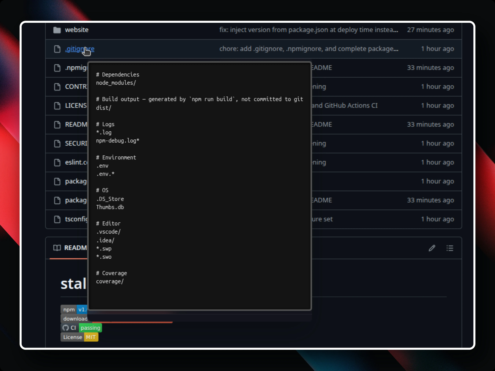

# Peek-a-Repo

Peek inside GitHub files and folders **without clicking**.

A small Chrome extension born out of pure developer frustration.

<p align="center">
  
</p>

**[Install from the Chrome Web Store](https://chrome.google.com/webstore/detail/peek-a-repo/aanpngikpldepannbdkglfohenbkhomp)**

---

## The problem

Have you ever been inside a GitHub repository and felt this loop?

You open a file.
You go back.
You open another file.
You go back.
Again. And again.

Now add images to the mix.

You can't even see what an image is unless you open it.
So you end up opening every single image, one by one, just to figure out which one you want.

This constant back-and-forth is frustrating.
Later I learned this behavior is called _pogo-sticking_ — but at that moment, it was just annoying.

I hit this problem while browsing a wallpaper repository.
I had to select a few images, and opening each one individually was driving me crazy.
I searched for a solution. I didn't find one.

So I decided to build my own.

---

## The idea

What if you could just hover over a file in the GitHub file tree
and instantly see what's inside?

- Image file → show an image preview
- Code file → show the code (with syntax highlighting)
- Folder → show a mini file tree
- No clicking
- No page navigation
- No losing context

Inspired by Wikipedia-style hover popups, Peek-a-Repo lets you _peek_ inside files before opening them.
Worth reading the [Wikipedia article](https://wikimediafoundation.org/news/2018/04/20/why-it-took-a-long-time-to-build-that-tiny-link-preview-on-wikipedia/) where they explain why it took so long to build that tiny link preview on Wikipedia. It's cool to see how much effort went into making that tiny link preview on Wikipedia.

---

## Features

- **Hover previews for images** — supports any aspect ratio, scaled by resolution

- **Hover previews for code files** — syntax highlighting via Prism.js (JS, TS, HTML, CSS, JSON, Markdown, Rust, Go, Python, and more)

- **Hover previews for folders** — mini GitHub-style file tree with folder/file icons; hover files inside to preview them too

- **Nested previews** — hover a file inside a folder popup to peek its contents inline

- **Smooth momentum scrolling** — velocity-based scroll with decay inside the popup

- **"View more"** — expand truncated files without leaving the page

- **Smart caching** — repeated hovers are instant, no extra API calls

- **Privacy-first** — your GitHub token is stored locally in `chrome.storage`, never sent anywhere

---

## Setup

### Install from the Chrome Web Store

The easiest way — **[install Peek-a-Repo here](https://chrome.google.com/webstore/detail/peek-a-repo/aanpngikpldepannbdkglfohenbkhomp)**.

After installing, click the extension icon and sign in with GitHub (one click, uses OAuth device flow). That's it — go to any GitHub repo and start hovering.

### Load unpacked (manual install)

1. Clone this repository:

   ```bash
   git clone https://github.com/xevrion/peek-a-repo.git
   ```

2. Open `chrome://extensions` (or `brave://extensions`)

3. Enable **Developer mode** (top-right toggle)

4. Click **Load unpacked** and select the project folder

5. Click the extension icon → sign in with GitHub or paste a Personal Access Token

---

## Development

1. Install dependencies (only Tailwind is needed):

   ```bash
   npm install
   ```

2. Run Tailwind in watch mode:

   ```bash
   npx tailwindcss -i ./input.css -o ./tailwind.css --minify --watch
   ```

3. Make changes to the code

4. Reload the extension from `chrome://extensions`

---

## Privacy

Peek-a-Repo does not collect any user data. Your GitHub token is stored locally and only used to make GitHub API requests directly from your browser. See the full [privacy policy](PRIVACY.md).

---

## Contributing

Contributions are welcome!
Feel free to open issues or pull requests.
Read the [contributing guide](CONTRIBUTING.md) for more details.

---

## Star History

[](https://www.star-history.com/#xevrion/peek-a-repo&type=date&legend=top-left)
